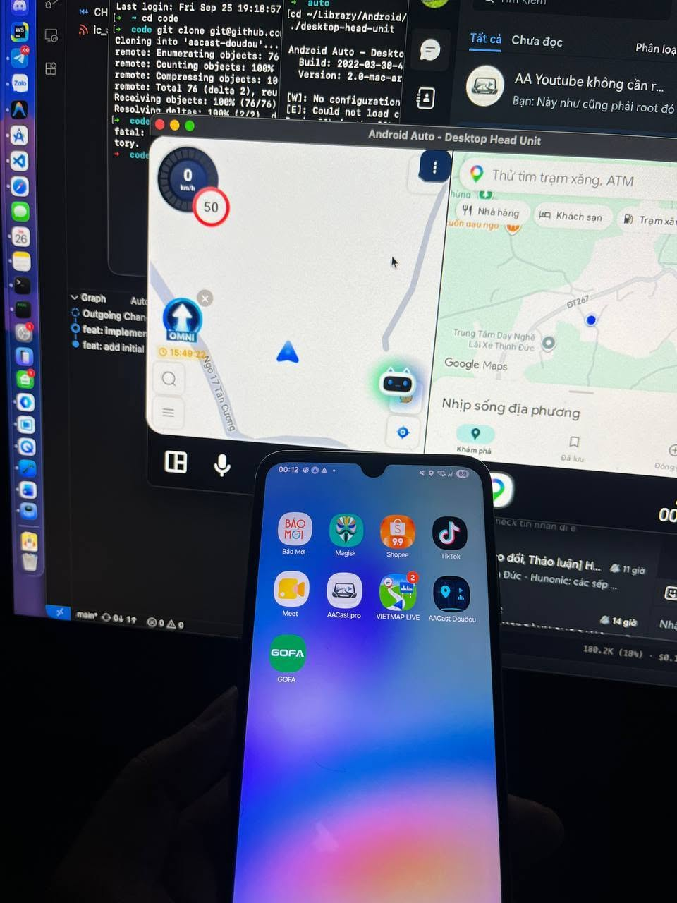

# AACast Doudou

[English](README.md) | [Tiếng Việt](README.vi.md)

Chia màn hình **Android Auto** thành 2–3 ô, mỗi ô chạy một ứng dụng Android thật
(Google Maps, VietMap, YouTube…), dựa trên **VirtualDisplay + root shell + Xposed injection**.

| | |
|---|---|
| Package | `com.carassistant.v10` |
| Version | 1.0.0 (versionCode 3) |
| minSdk / targetSdk / compileSdk | 29 / 36 / 36 |
| Quyền Android | **không có quyền nào** — mọi thao tác đặc quyền đi qua `su` |
| Native libs | không |
| Kích thước APK release | ~390 KB |

> **Cảnh báo**: dự án can thiệp vào quá trình projection của Android Auto và cần root.
> Hãy đọc kỹ phần [Yêu cầu](#1-yêu-cầu) và [Giấy phép & miễn trừ](#7-giấy-phép--miễn-trừ-trách-nhiệm)
> trước khi cài.

---

## Demo



*Chia màn hình trên Android Auto (Desktop Head Unit): hai ô cạnh nhau — dẫn đường OMNI + Google Maps.*

---

## 1. Tính năng

- **6 kiểu bố cục**: 2 cột, 2 hàng, 3 cột, 3 hàng, 1 lớn trái + 2 phải, 1 lớn trên + 2 dưới.
- **Chọn app cho từng ô** với danh sách app đã cài, tìm kiếm không phân biệt dấu/hoa thường.
- **Kéo thả ⋮** để đổi vị trí app giữa các ô; **kéo vạch chia** để đổi kích thước từng ô.
- **Giao diện Cockpit HUD** trên điện thoại: xem trước màn hình xe, đổi bố cục, gán app,
  kiểm tra root, restart Android Auto nhanh.
- **Tự ẩn dock Android Auto** khi đang chia màn hình và khôi phục khi thoát (dock lease).
- **Mở rộng vùng hiển thị** của app trên layout Coolwalk (ẩn Dashboard khi đang dùng).
- Không thêm thư viện ngoài; logic thuần Java có unit test (`LayoutMath`, `TileOrder`).

---

## 2. Yêu cầu

| Mục | Yêu cầu |
|---|---|
| Android | 10+ (API 29+) |
| Root | Magisk / KernelSU / APatch — `su` phải được cấp **vĩnh viễn** cho app |
| Xposed | LSPosed, scope: **`android` (System Framework)** + **`com.google.android.projection.gearhead` (Android Auto)** |
| Android Auto | `com.google.android.projection.gearhead` đã cài trên điện thoại (kết nối xe hoặc dùng Desktop Head Unit để test) |

---

## 3. Build

### 3.1 Yêu cầu môi trường

- JDK 17
- Android SDK với Build-Tools + Platform 36 (`compileSdk 36`)
- Gradle wrapper có sẵn trong repo — chỉ cần `./gradlew`.

### 3.2 Lệnh build

```bash
./gradlew :app:assembleDebug      # bản debug — nhanh, để phát triển
./gradlew :app:assembleRelease    # bản release (đã ký nếu có keystore) — bản để dùng
./gradlew :app:testDebugUnitTest  # unit test logic hình học / thứ tự ô
```

> **KHÔNG bật `minifyEnabled true` cho release.** Thư viện SDK đóng kèm
> (`app/libs/aasdk-legacy.jar` + `aasdk-legacy.dex`) là bytecode đã qua xử lý sẵn;
> R8 chạy thêm có thể merge class và gây `java.lang.InstantiationError` ngay khi
> Android Auto host `CarActivity`.

### 3.3 Ký release

Release đọc `keystore.properties` ở thư mục gốc (file này **không** được commit):

```properties
storeFile=your-keystore.jks
storePassword=...
keyAlias=...
keyPassword=...
```

Nếu thiếu `keystore.properties`, Gradle vẫn build nhưng APK **không được ký**.
Task `distRelease` sẽ copy APK ra `dist/` kèm file SHA-256.

### 3.4 Thư viện đóng kèm

`app/libs/` chứa các artifact phục vụ build (đã commit để clone là build được ngay):

| File | Vai trò |
|---|---|
| `aasdk-legacy.jar` | Stub compile cho SDK Android Auto thế hệ cũ (`CarActivity`, `CarActivityService`…) — không còn phân phối trên Maven |
| `aasdk-legacy.dex` | Bytecode SDK tương ứng, được đóng thẳng vào APK khi merge dex |
| `xposed-api-82.jar` | API Xposed (`compileOnly`) — runtime do LSPosed cung cấp |

Khi cần tải lại Xposed API: `tools/fetch-xposed-api.sh`.

### 3.5 Kiểm tra APK sau build

```bash
tools/verify-apk.sh app/build/outputs/apk/release/app-release.apk
```

Script kiểm tra: `assets/xposed_init`, các class bắt buộc **được định nghĩa** trong dex
(dùng `dexdump`), Xposed API **không** bị đóng gói, manifest (package/label/service/provider),
chữ ký và hash.

---

## 4. Cài đặt & kích hoạt

### 4.1 Cài APK

> **Khuyến nghị**: cài bằng [**KingInstaller**](https://github.com/fcaronte/KingInstaller/releases)
> để Android Auto nhận app là do Play Store cài.
> Hướng dẫn từng bước: [**INSTALL-KINGINSTALLER.vi.md**](INSTALL-KINGINSTALLER.vi.md).

```bash
adb install -r app/build/outputs/apk/release/app-release.apk
```

### 4.2 Bật module LSPosed

**LSPosed** → Modules → **AACast Doudou** → bật module và chọn:

- `android` — System Framework
- `com.google.android.projection.gearhead` — Android Auto

Sau đó khởi động lại điện thoại.

### 4.3 Cấp quyền Root

Mở **AACast Doudou** trên điện thoại và cấp quyền **root vĩnh viễn**.

### 4.4 Sử dụng

1. Chọn bố cục chia màn hình và ứng dụng cho từng ô.
2. Kết nối điện thoại với Android Auto.
3. Mở **AACast Doudou** trên màn hình xe.
4. Nhấn **Start split screen**.
5. Trên màn hình xe:
   - Nhấn **⋮** để đổi ứng dụng.
   - Kéo **⋮** sang ô khác để đổi vị trí.
   - Kéo thanh ở giữa để thay đổi kích thước.

> Nếu không muốn khởi động lại máy: `adb shell am force-stop com.google.android.projection.gearhead`
> để hook cài lại.

---

## 5. Kiến trúc

```
gearhead (Android Auto) ──host──> AACastCarActivity (process app)
                                     │
                     ┌───────────────┴────────────────┐
                     │  RootView (3 × PaneView)        │
                     │  mỗi PaneView = TextureView     │
                     └──────────┬─────────────────────┘
                                │ Surface
                     VirtualDisplay "AACast Doudou 1..3"
                                ▲
                                │ su: am start --display <id>
                     app con (Maps / VietMap / YouTube…)
```

- **Car App**: `AACastCarService` (kế thừa `CarActivityService`) đăng ký với Android Auto
  qua `CATEGORY_PROJECTION`.
- **VirtualDisplay**: mỗi ô tạo 1 màn hình ảo (`flags = 10` = PRESENTATION|OWN_CONTENT_ONLY,
  density 160) và mirror vào `TextureView` trong layout.
- **Root shell**: một phiên `su` bền (`RootShellSession`) chạy `am start --display`,
  `input touchscreen -d <id> tap|swipe`, `input -d <id> keyevent 4`.
- **Xposed** (`aabridge/AACastBridge` là entry point, khai báo trong `assets/xposed_init`):

  | Process | Hook | Việc |
  |---|---|---|
  | `android` | `VirtualDisplayDevice#getDisplayDeviceInfoLocked` | +`FLAG_OWN_DISPLAY_GROUP` +`FLAG_ALWAYS_UNLOCKED` |
  | `android` | `PhoneWindowManager#shouldDispatchInputWhenNonInteractive` | cho input khi màn hình tắt |
  | `android` | `InputManagerService#injectInputEventToTarget` | re-inject theo `displayId` |
  | gearhead | `getInstallerPackageName`, `InstallSourceInfo.*` | spoof `com.android.vending` |
  | gearhead | class kiểm tra quyền của AA | trả `true` cho package của app |
  | gearhead | `Application#attach`, `WindowManagerGlobal#addView` | ẩn dock + che display `GhFacetBar` + mở rộng vùng activity |

- **Lease dock**: `DockStateProvider` (`content://com.carassistant.v10.launcher.dock/state`)
  — app ghi `visible_until = now + 3000` mỗi 1 s; gearhead đọc và ẩn/khôi phục dock.
- Tất cả hook đều **fail-open**: không tìm thấy class/method thì bỏ qua, không làm hỏng host.

### Cấu trúc mã nguồn

```
app/src/main/java/com.carassistant.v10/
├── AACastCarActivity.java     # CarActivity — UI trên màn hình xe
├── AACastCarService.java      # đăng ký Car App với Android Auto
├── AACastDisplay.java         # nhận diện display ảo của app (dùng chung app + hook)
├── RootView.java              # view gốc: pane, overlay, prefs, lifecycle
├── PaneView.java              # 1 ô: TextureView + VirtualDisplay + app con
├── PaneContainer.java         # xếp pane/divider, kéo-thả đổi chỗ
├── DividerView.java           # tay nắm kéo chỉnh tỉ lệ
├── LayoutMath.java            # toán hình học 6 kiểu bố cục (có unit test)
├── LayoutRects.java           # kết quả rect pane/divider
├── TileOrder.java             # thứ tự ô (có unit test)
├── RootShellSession.java      # phiên `su` bền
├── DockStateProvider.java     # IPC lease dock với gearhead
├── LeaseTicker.java           # ghi lease mỗi 1 s
├── MainActivity.java          # giao diện Cockpit HUD trên điện thoại
├── AppCatalog.java / AppEntry.java
├── aabridge/AACastBridge.java # entry point Xposed
└── hook/                      # các hook system_server + gearhead
```

---

## 6. Xử lý sự cố

| Triệu chứng | Nguyên nhân thường gặp | Xử lý |
|---|---|---|
| Ô hiện "Cần quyền root…" | `su` không trả về UID 0 | cấp quyền vĩnh viễn trong trình quản lý root |
| Ô hiện "Chưa thể mở X" | `am start` lỗi (activity đổi tên, app bị hạn chế) | xem log `Launch failed:` — stderr của `am` được in kèm |
| Ô hiện "Chưa cài X" | Activity không `exported`/`enabled` hoặc thiếu permission | thử app khác; kiểm tra `ActivityInfo` của app đó |
| Ô đen/trắng dù không báo lỗi | app con từ chối render trên display ảo (DRM, chống chụp màn hình) | giới hạn của app con — thử app khác |
| Chạm không ăn | hook `[AACast Input]` chưa cài | kiểm tra log hook; xác nhận LSPosed đã bật scope `android` |
| Dock AA vẫn hiện | tên resource dock đổi theo phiên bản AA | log `No supported bottom dock found` → cập nhật `DOCK_NAMES` trong `GearheadDockPatcher` |
| AA không thấy app trong danh sách | spoof installer không khớp phiên bản AA | xem log `[AACast Dock]`; thử cài app từ Play Store |
| Thoát split screen mà dock không trở lại | lease không hết hạn | xem log `Launcher lease ended`; kiểm tra vòng đời `AACastCarActivity` |
| App tự thoát khi mở | R8 nuốt entry / thiếu SDK | chạy `tools/verify-apk.sh` |
| App không chạy sau khi Android Auto cập nhật | tên class obfuscate của AA đổi | hook fail-open nên app vẫn mở được; cập nhật lại hằng số class trong `hook/` |

Log hữu ích:

```bash
adb logcat -v time -s AACastDoudou AACastDock "AACast Display" "AACast Input"
adb shell dumpsys display | grep -A3 "AACast Doudou"
```

---

## 7. Đóng góp

Mọi đóng góp đều được hoan nghênh:

1. Fork repo, tạo nhánh mới cho tính năng/sửa lỗi.
2. Giữ code phong cách hiện tại: **Java thuần, không thêm thư viện ngoài**, comment ngắn gọn,
   logic tách khỏi View khi có thể.
3. Thêm/sửa unit test cho logic trong `LayoutMath`, `TileOrder` nếu có thay đổi.
4. Chạy trước khi gửi PR:

   ```bash
   ./gradlew :app:testDebugUnitTest :app:assembleDebug :app:lintDebug
   ```

5. Mở Pull Request kèm mô tả thay đổi, thiết bị/phiên bản Android Auto đã test (nếu có).

Nếu bạn gặp lỗi trên thiết bị, hãy kèm: `logcat` đầy đủ, `dumpsys display`, phiên bản Android Auto
và ROM/Android.

---

## Cộng đồng

Mọi câu hỏi, ý tưởng và thảo luận chung đều được hoan nghênh tại group Facebook:

[**Tham gia group Facebook →**](https://www.facebook.com/groups/2327824764621369)

---

## 8. Giấy phép & miễn trừ trách nhiệm

- Mã nguồn dành cho **học tập, nghiên cứu và sử dụng cá nhân**.
- Việc can thiệp vào quá trình projection của Android Auto và ẩn UI của gearhead có thể
  vi phạm điều khoản sử dụng của Google. Người triển khai tự chịu trách nhiệm.
- Thư viện trong `app/libs` là các class SDK Android Auto thế hệ cũ (thuộc Google), chỉ được
  đóng kèm để phục vụ build; không phải sản phẩm của dự án.
- Dự án chưa chọn giấy phép nguồn mở. Trước khi tái sử dụng/phân phối, hãy trao đổi với tác giả.

---

## ☕ Ủng hộ dự án

Nếu AACast Doudou giúp bạn tiết kiệm thời gian, bạn có thể mời tác giả một ly cà phê
qua PayPal. Cảm ơn bạn rất nhiều!

[](https://paypal.me/daihieptn)
